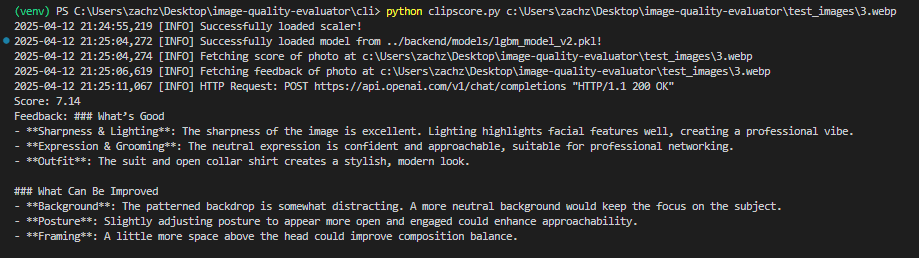

# Image Quality Evaluator

**An API bundled with a CLI tool for scoring and evaluating photo quality using CLIP image embeddings and a custom-trained LightGBM regression model.**

This project predicts perceived image quality using visual embeddings and regression, supporting use cases like profile photo optimization, content curation, and image ranking.

---

## 🔍 How It Works

1. Extracts **CLIP-L/14** image embeddings to represent the photo semantically.
2. Feeds embeddings into a **LightGBM regression model** trained on real-world visual aesthetics scores.
3. Returns a **numeric score (1–10)** reflecting predicted image quality.
4. Integration with **GPT-4 Vision** to generate feedback and improvement suggestions. (CLI ONLY)

---

## 🛠️ Project Features

- ✅ FastAPI-based API interface
- ✅ CLIP image embedding extraction
- ✅ Custom-trained LightGBM model (R²=0.90)
- ✅ GPT-4 Vision powered image feedback
- ✅ Modular and extensible code structure

---

## 🧠 Model Training Process

The regression model was trained on a dataset of facial images labeled with **perceived image quality scores**, using a pipeline designed for performance and generalization:

- **Data Collection**: Curated labeled datasets containing 6000+ human-scored facial images
- **GPU Embedding Generation**: Extracted CLIP-L/14 image embeddings in batches using RunPod cloud GPUs for efficient processing, avoiding CPU bottlenecks
- **Label Normalization**: Scaled quality scores to a 0–1 range using `MinMaxScaler` to improve training stability
- **Oversampling Extremes**: Duplicated samples from high (≥8.5) and low (≤2.5) quality ranges to correct label imbalance
- **Sample Weighting**: Assigned higher training weights to extreme-score samples to emphasize their influence during optimization
- **Error-Focused Tuning**: Used bin-level prediction analysis (low/mid/high/top) to guide sampling strategy and reduce drift across score categories

The final LightGBM model achieved **R² = 0.90** and **RMSE ≈ 0.56** on validation data, indicating strong predictive performance across the full quality spectrum.

---

## 📸 Example Output

Below is a sample of what the CLI returns after analyzing an image:

---

⚠️ Disclaimer
The API currently only accepts public Imgur URLs due to legal constraints around processing uploaded user images. This design choice ensures the tool avoids storing, hosting, or handling any private image data — maintaining user privacy and reducing liability.

Note: A basic frontend is currently in development but has not been deployed. The repo contains early-stage implementation code, which will be connected to the API once complete. There is no live demo available at this time.
